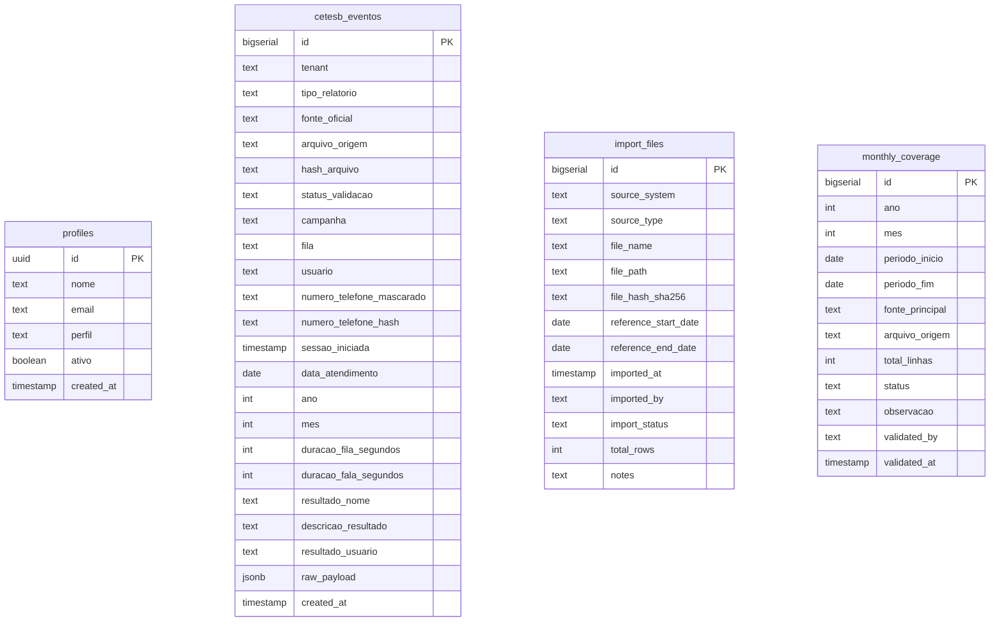

# Modelo de Dados - Portal CETESB

Este documento descreve detalhadamente a modelagem das tabelas do banco de dados (Supabase/PostgreSQL) para o **Portal CETESB - Retenção Histórica**.

---

## 📊 Diagrama Entidade-Relacionamento (ERD)

---

## 🛠️ Tabelas do Schema

### 1. Tabela `profiles`
Contém as credenciais básicas e perfis de controle de acesso atrelados ao Supabase Auth (`auth.users`).

| Coluna | Tipo | Restrições | Descrição |
|---|---|---|---|
| `id` | `uuid` | `PRIMARY KEY`, `REFERENCES auth.users(id) ON DELETE CASCADE` | ID de usuário idêntico ao do Supabase Auth. |
| `nome` | `text` | `NOT NULL` | Nome completo do usuário ou operador. |
| `email` | `text` | `NOT NULL` | E-mail corporativo cadastrado. |
| `perfil` | `text` | `NOT NULL` | Papel de acesso: `jrc_admin`, `jrc_operacao`, `jrc_auditoria`, `cetesb_consulta` ou `cetesb_gestao`. |
| `ativo` | `boolean` | `DEFAULT true` | Habilita ou desativa a conta do usuário no portal. |
| `created_at` | `timestamp` | `DEFAULT now()` | Data de criação do perfil. |

### 2. Tabela `cetesb_eventos`
Tabela principal contendo todos os eventos de ligação e URA de 2025 e 2026 unificados.

| Coluna | Tipo | Restrições | Descrição |
|---|---|---|---|
| `id` | `bigserial` | `PRIMARY KEY` | Identificador único autogerado incremental. |
| `tenant` | `text` | `NOT NULL DEFAULT 'CETESB'` | Tenant correspondente ao órgão. |
| `tipo_relatorio` | `text` | `NOT NULL` | Tipo do registro: `ATENDIMENTO_OPERACAO` ou `URA`. |
| `fonte_oficial` | `text` | `NOT NULL` | Fonte do arquivo de origem: `EXCEL_2025` ou `SYTEL_2026`. |
| `arquivo_origem` | `text` | | Nome do arquivo Excel físico correspondente. |
| `hash_arquivo` | `text` | | Hash SHA-256 do arquivo original importado. |
| `status_validacao` | `text` | `DEFAULT 'PENDENTE'` | Status da auditoria: `VALIDADO`, `PENDENTE`, `DIVERGENTE`. |
| `campanha` | `text` | | Nome da campanha (ex: `CETESB_EMERGENCIAS`). |
| `fila` | `text` | | Nome da fila operacional. |
| `usuario` | `text` | | Nome do usuário/agente (null ou omitido em URA). |
| `numero_telefone_mascarado` | `text` | | Telefone com o meio protegido (`119****2885`). |
| `numero_telefone_hash` | `text` | | Hash SHA-256 do telefone original limpo para conciliações. |
| `sessao_iniciada` | `timestamp` | | Data e hora exata do início da sessão. |
| `data_atendimento` | `date` | `GENERATED ALWAYS AS (sessao_iniciada::date) STORED` | Coluna gerada da data exata sem hora. |
| `ano` | `int` | `GENERATED ALWAYS AS (extract(year from sessao_iniciada)::int) STORED` | Ano gerado automaticamente. |
| `mes` | `int` | `GENERATED ALWAYS AS (extract(month from sessao_iniciada)::int) STORED` | Mês gerado automaticamente. |
| `duracao_fila_segundos` | `int` | | Duração do tempo de fila da chamada em segundos. |
| `duracao_fala_segundos` | `int` | | Duração de tempo de conversação/permanência na URA. |
| `resultado_nome` | `text` | | Opção selecionada pelo cliente na URA. |
| `descricao_resultado` | `text` | | Descrição livre do resultado da chamada. |
| `resultado_usuario` | `text` | | Resolução do usuário do call center (Sytel 2026). |
| `raw_payload` | `jsonb` | | Payload original em JSON de toda a linha da planilha. |
| `created_at` | `timestamp` | `DEFAULT now()` | Timestamp da inserção no banco. |

### 3. Tabela `import_files`
Tabela para auditoria física das cargas históricas.

| Coluna | Tipo | Restrições | Descrição |
|---|---|---|---|
| `id` | `bigserial` | `PRIMARY KEY` | Identificador da importação. |
| `source_system` | `text` | `NOT NULL` | Sistema de origem dos dados. |
| `source_type` | `text` | `NOT NULL` | Tipo da fonte física (`EXCEL`, `CSV`, `API`). |
| `file_name` | `text` | `NOT NULL` | Nome completo do arquivo original importado. |
| `file_path` | `text` | | Caminho do arquivo físico no servidor local. |
| `file_hash_sha256` | `text` | `NOT NULL UNIQUE` | Hash SHA-256 gerado impedindo duplicações. |
| `reference_start_date`| `date` | | Data inicial encontrada nos registros da planilha. |
| `reference_end_date` | `date` | | Data final encontrada nos registros da planilha. |
| `imported_at` | `timestamp`| `DEFAULT now()` | Data/hora de gravação da carga no Supabase. |
| `imported_by` | `text` | | Usuário/E-mail de quem rodou o importador. |
| `import_status` | `text` | `DEFAULT 'PENDENTE'` | Status final: `PROCESSANDO`, `SUCESSO`, `ERRO`. |
| `total_rows` | `int` | | Total de registros importados com sucesso. |
| `notes` | `text` | | Observações extras da carga. |

---

## 👁️ Views Utilizadas pelo Frontend

### `vw_cetesb_atendimentos_operacao`
Filtra apenas registros de atendimento com agentes humanos (`tipo_relatorio = 'ATENDIMENTO_OPERACAO'`), mapeando os nomes das colunas de forma limpa e tratando campos vazios ou ausentes de usuário.

### `vw_cetesb_ura`
Filtra registros eletrônicos da URA (`tipo_relatorio = 'URA'`), omitindo colunas relativas a agentes (agente/usuário) e incluindo a opção selecionada da URA (`resultado_nome`).

### `vw_cetesb_auditoria`
Extrai os registros da tabela `import_files` ordenando-os por importação mais recente.
