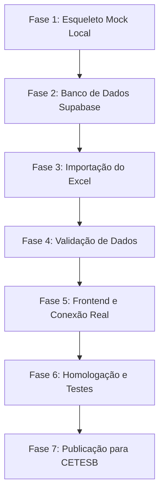

# Plano de Desenvolvimento e Implantação - Portal CETESB

Este documento detalha o planejamento estratégico dividido em 7 fases cronológicas essenciais para garantir que a JRC forneça o **Portal CETESB - Retenção Histórica** com total integridade de dados e estabilidade em ambiente de produção.

---

## 📈 Cronograma de Fases



---

## 🔍 Detalhamento das Fases

### 📅 Fase 1 - Esqueleto Local em Mock (Estado Atual)
- **Status**: **CONCLUÍDO**
- **Objetivos**:
  - Criar scaffolding do Next.js 15, TypeScript e Tailwind CSS.
  - Implementar o visual premium baseado na Sytel com sidebar fixa e cabeçalho.
  - Desenvolver lógica mock local chaveável para testar a aplicação imediatamente.
  - Criar dados simulados (`data/mock/sample-events.json`) cobrindo atendimentos e registros de URA 2025/2026.
  - Implementar exportação funcional client-side de CSV e planilhas Excel legítimas baseadas em filtros.

### 📅 Fase 2 - Banco de Dados Supabase
- **Objetivos**:
  - Criação da infraestrutura do Supabase (Self-hosted via Docker ou Cloud).
  - Execução das migrations SQL na base PostgreSQL para criação das tabelas `cetesb_eventos`, `import_files`, `monthly_coverage` e `profiles`.
  - Configuração das views operacionais e views de auditoria.
  - Ativação do Row Level Security (RLS) e regras de leitura condicionadas a perfis ativos.
  - Associação de e-mails criados no Supabase Auth com a tabela `profiles` (semente).

### 📅 Fase 3 - Importação dos Excel
- **Objetivos**:
  - Movimentar os dois arquivos físicos históricos recuperados de 2025 e 2026 para a pasta `data/raw/`.
  - Executar a inspeção estática `npm run inspect:excel` para conferir cabeçalhos e nomes de abas fisicamente.
  - Executar a carga real via script Node `npm run import:excel` efetuando:
    - Geração de hash SHA-256 para impedir cargas duplicadas do mesmo arquivo físico.
    - Limpeza de strings e mascaramento criptográfico de telefones.
    - Conversão de durações (formatos `mm:ss` ou `hh:mm:ss`) para inteiros de segundos.
    - Gravação batch dos eventos de Atendimento Humano e URA no banco real.
    - Atualização do status do arquivo em `import_files`.

### 📅 Fase 4 - Validação dos Dados
- **Objetivos**:
  - Executar auditoria de consistência pós-importação rodando `npm run validate:data`.
  - Validar e registrar linhas sem data iniciada, sem campanha ou registros duplicados prováveis.
  - Conferir no terminal a distribuição exata de volumes acumulados agrupados por mês, por tipo de relatório e por fonte oficial.

### 📅 Fase 5 - Frontend Final (Produção)
- **Objetivos**:
  - Ajustar o arquivo `.env` alterando as variáveis centrais de chaveamento:
    ```env
    NEXT_PUBLIC_USE_MOCK_DATA=false
    MOCK_AUTH=false
    ```
  - Subir a aplicação local conectada ao Supabase real executando `npm run dev`.
  - Homologar as telas Dashboard (puxando estatísticas reais agregadas), Atendimentos Operação, URA CETESB (sem agente/usuário) e Auditoria de Cargas (mostrando arquivos importados e seus hashes).

### 📅 Fase 6 - Homologação Interna
- **Objetivos**:
  - Realizar simulações de login de diferentes papéis (`jrc_admin`, `cetesb_gestao`, `cetesb_consulta`).
  - Validar que a coluna "Usuário" nos relatórios de URA permaneça oculta e sem filtros correspondentes na tela.
  - Confirmar que nenhum telefone original/aberto conste na interface do portal.
  - Validar a velocidade de paginação da tabela grande (chaveando entre volumes de 50, 100 e 500 registros por página).

### 📅 Fase 7 - Publicação para CETESB
- **Objetivos**:
  - Executar build de produção do Next.js (`npm run build`).
  - Deploy em servidor próprio da JRC seguindo as diretrizes do guia operacional.
  - Configuração do proxy reverso Nginx, processos gerenciados com PM2 e ativação de HTTPS via SSL Let's Encrypt.
  - Fornecimento das credenciais de acesso oficiais para os gestores da CETESB.
